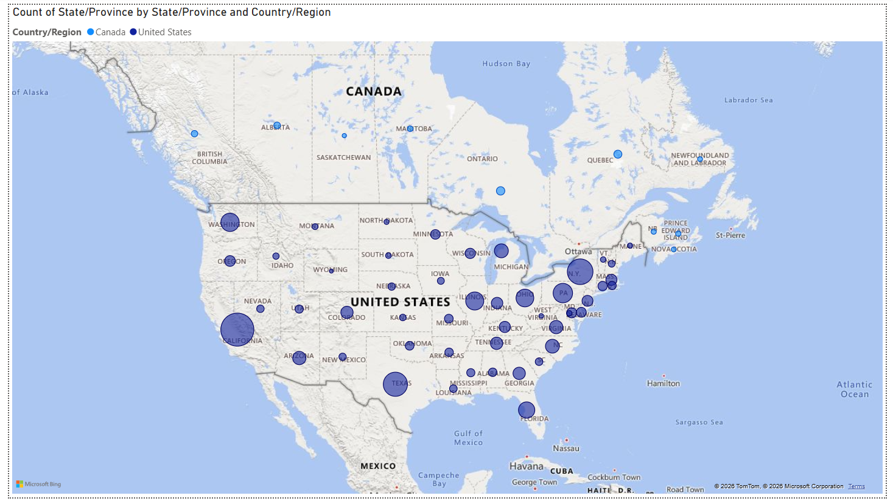

# Introduction
This personal project is to apply SQL (Structured Query Language) and Power BI to perform data analysis on a fictional superstore sales dataset.
The source of the dataset is from Tableau: https://public.tableau.com/app/learn/sample-data

## Importing Dataset
### MySQL
The superstore sales dataset from Tableau is in `.xlsx` format. Create a copy in `.csv` format so that MySQL Table Data Import Wizard can recognize it.  

The dataset consists of 10194 rows with no missing data. However, it is recommended to drop the `Product Name` column as it contains Unicode characters that are not recognized by MySQL, which may affect the import process.  

In MySQL, create a schema named `project` and use the wizard to import the dataset as `superstore`.  

Note that the `Postal Code` column should be defined as `text` rather than `int` because Canadian postal code are alphanumeric. Otherwise, this column can be dropped as it will not be used in the analysis. 

```sql
CREATE DATABASE IF NOT EXISTS project;
```

Check whether the dataset has been imported correctly using the following query:

```sql
SELECT COUNT(*)
FROM superstore;
```

Then, rename several columns to align with SQL naming conventions:

```sql
ALTER TABLE superstore
RENAME COLUMN `Ship Mode` TO Ship_Mode,
RENAME COLUMN `Customer Name` TO Customer_Name,
RENAME COLUMN `Country/Region` TO Country,
RENAME COLUMN `State/Province` TO State,
RENAME COLUMN `Sub-Category` TO Sub_Category;
```

### Power BI
Microsoft Power BI can import `.xlsx` files directly. Import and name the dataset as `superstore`. Make sure all the 10194 rows are successfully loaded by checking the Table view.

## Analysis
### Ship Mode
There are 4 shipping modes in the dataset: Standard Class, Second Class, First Class, and Same Day. The following query is used to obtain the count for each shipping mode:

```sql
SELECT Ship_Mode, COUNT(*) AS Count
FROM superstore
GROUP BY Ship_Mode
ORDER BY Count DESC;
```

| Ship_Mode      | Count |
|----------------|-------|
| Standard Class | 6120  |
| Second Class   | 1979  |
| First Class    | 1548  |
| Same Day       | 547   |

From the data, all Standard Class orders begin shipping at least 3 days after the order date, with the longest delay being one week.  
For Second Class, the earliest shipping date is 2 days after the order date, while the latest is after 5 days.  
First Class orders can ship as early as at the next day after the order date and as late as 3 days afterwards.  
As the name suggests, Same Day orders ship on the order date, with some cases delay to the next day.

### Segment
There are 3 segments in the dataset: Consumer, Corporate, and Home Office. A similar query can be used to obtain the count for each segment:

```sql
SELECT Segment, COUNT(*) AS Count
FROM superstore
GROUP BY Segment
ORDER BY Count DESC;
```

| Segment     | Count |
|-------------|-------|
| Consumer    | 5281  |
| Corporate   | 3090  |
| Home Office | 1823  |

The majority of orders come from the Consumer segment, followed by Corporate and Home Office.

### Country and State
There are 2 countries in the dataset: United States and Canada. The counts of countries and their respective states are obtained using the following queries:

```sql
SELECT Country, COUNT(*) AS Count
FROM superstore
GROUP BY Country;

SELECT Country, State, COUNT(*) AS Count
FROM superstore
GROUP BY Country, State
ORDER BY Country, Count;
```



The map visualization in Power BI shows that California has the highest number of orders (2001 orders), followed by New York (1128 orders).

### Category and Sub-Category
There are 3 categories in the dataset: Furniture, Office Supplies, and Technology. Each category is further divided into sub-categories. For example, Technology includes Copiers, Machines, Accessories, and Phones. The following query is used to obtain the count of each Category and its sub-categories:

```sql
WITH category_count AS (
	SELECT Category, Sub_Category, COUNT(*) AS Count
	FROM superstore
	GROUP BY Category, Sub_Category
)
SELECT Category, Sub_Category, Count, SUM(Count) OVER (PARTITION BY Category) AS Category_Total
FROM category_count
ORDER BY Category, Count;
```

| Category        | Sub_Category | Count | Category_Total |
|-----------------|--------------|-------|----------------|
| Furniture       | Bookcases    | 232   | 2201           |
| Furniture       | Tables       | 326   | 2201           |
| Furniture       | Chairs       | 634   | 2201           |
| Furniture       | Furnishings  | 1009  | 2201           |
| Office Supplies | Supplies     | 192   | 6128           |
| Office Supplies | Fasteners    | 229   | 6128           |
| Office Supplies | Envelopes    | 256   | 6128           |
| Office Supplies | Labels       | 368   | 6128           |
| Office Supplies | Appliances   | 474   | 6128           |
| Office Supplies | Art          | 821   | 6128           |
| Office Supplies | Storage      | 856   | 6128           |
| Office Supplies | Paper        | 1384  | 6128           |
| Office Supplies | Binders      | 1548  | 6128           |
| Technology      | Copiers      | 70    | 1865           |
| Technology      | Machines     | 117   | 1865           |
| Technology      | Accessories  | 775   | 1865           |
| Technology      | Phones       | 903   | 1865           |

Office Supplies has the highest number of orders (6128 orders), followed by Furniture (2201 orders) and Technology (1865 orders). Among the sub-categories, Furnishings has the highest number of orders in Furniture (1009), Binders in Office Supplies (1548), and Phones in Technology (903).

### Customer with the Highest Number of Orders
Note that some customers may share the same name, so it is recommended to use their IDs to differentiate them. In SQL, the following query is used to find the number of orders made by each customer:

```sql
SELECT Customer_Name, COUNT(*) AS Orders
FROM superstore
GROUP BY `Customer ID`, Customer_Name
ORDER BY Orders DESC;
```

The result shows that `William Brown` has the highest number of orders (41). Next, the following query is used to show his orders by category and sub-category:

```sql
SELECT Customer_Name, Category, Sub_Category, COUNT(*) AS Count
FROM superstore
WHERE Customer_Name = "William Brown"
GROUP BY Category, Sub_Category
ORDER BY Category;
```

| Customer_Name | Category        | Sub_Category | Count |
|---------------|-----------------|--------------|-------|
| William Brown | Furniture       | Chairs       | 1     |
| William Brown | Furniture       | Furnishings  | 5     |
| William Brown | Furniture       | Tables       | 2     |
| William Brown | Office Supplies | Appliances   | 3     |
| William Brown | Office Supplies | Art          | 2     |
| William Brown | Office Supplies | Binders      | 12    |
| William Brown | Office Supplies | Envelopes    | 1     |
| William Brown | Office Supplies | Fasteners    | 2     |
| William Brown | Office Supplies | Paper        | 3     |
| William Brown | Office Supplies | Storage      | 2     |
| William Brown | Technology      | Accessories  | 3     |
| William Brown | Technology      | Machines     | 1     |
| William Brown | Technology      | Phones       | 4     |

In Power BI, to differentiate customers with the same name, a new column can be calculated using the following DAX code:

```DAX
Flag = IF(CALCULATE(DISTINCTCOUNT(superstore[Customer ID]), ALLEXCEPT(superstore, superstore[Customer Name])) > 1, 1, 0)
```

This `Flag` column can later be used as a legend to distinguish customer names that have only one ID from those shared by multiple IDs. In this dataset, the name `Harry Olson` is shared by 5 different customers.

### Sum of Profit
The sum of profit is analyzed across customers, segments, states, and categories. The query used is similar in each case, with one example shown below:

```sql
SELECT Customer_Name, SUM(Profit) AS Profits
FROM superstore
GROUP BY Customer_Name
ORDER BY Profits DESC;
```

| Customer_Name          | Profits             |
|------------------------|---------------------|
| Tamara Chand           | 8981.3239           |
| Raymond Buch           | 6976.095900000001   |
| Sanjit Chand           | 5757.411899999997   |
| Hunter Lopez           | 5622.4292000000005  |
| Adrian Barton          | 5444.8054999999995  |
...
| Henry Goldwyn          | -2797.9635          |
| Sharelle Roach         | -3333.9144          |
| Luke Foster            | -3583.977           |
| Grant Thornton         | -4108.6589          |
| Cindy Stewart          | -6626.3895          |

Although `William Brown` has the highest number of orders, he did not generate the most profit for the superstore. In fact, the total profit contributed by `William Brown` is only $692.39.  

From the results, `Tamara Chand` generated the highest profit ($8981.3239) with only 12 orders. 10 of these orders are from Office Supplies, and the remaining 2 are from Technology. However, the Office Supplies orders generated only $397.09, while the Technology orders generated the remaining $8584.2339.

On the other hand, `Cindy Stewart` generated the largest loss ($6626.3895) with 9 orders. 6 of these orders are from Office Supplies, and the remaining 3 are from Technology. Similarly, the Office Supplies orders resulted in a loss of $228.49, while the Technology orders resulted in a loss of $6397.8995.

Based on the results, it appears that Technology orders can generate either huge profits or significant losses. This may be due to the high sales prices of the items. Thus, the following query is used to identify the minimum and maximum sales values for each sub-category within Technology:

```sql
SELECT Sub_Category, MIN(Sales), MAX(Sales)
FROM superstore
WHERE Category = 'Technology'
GROUP BY Sub_Category;
```

| Sub_Category | MIN(Sales) | MAX(Sales) |
|--------------|------------|------------|
| Phones       | 2.21       | 4548.81    |
| Accessories  | 0.99       | 3347.37    |
| Machines     | 11.56      | 22638.48   |
| Copiers      | 17.28      | 17499.95   |

The results show that Machines and Copiers can reach maximum sales values in the tens of  thousands. Therefore, if large discounts are applied to these items, the superstore may suffer a huge loss.

### Regional Managers
A new table is created to store information about regional managers. The following query is used:

```sql
CREATE TABLE IF NOT EXISTS manager (
    Region VARCHAR(10) PRIMARY KEY,
    Manager TEXT
);

INSERT INTO manager
VALUES	('West', 'Sadie Pawthorne'),
		('East', 'Chuck Magee'),
        ('Central', 'Roxanne Rodriguez'),
        ('South', 'Fred Suzuki');
```

The `manager` table has `Region` as its primary key, which can be joined with the `superstore` table for deeper analysis.  

First, the number of orders handled by each manager is obtained using the following query:

```sql
SELECT Manager, Category, COUNT(*) AS Count, SUM(COUNT(*)) OVER (PARTITION BY Manager) AS Manager_Total
FROM manager
JOIN superstore
ON manager.Region = superstore.Region
GROUP BY Manager, Category
ORDER BY Manager_Total DESC, Category;
```

| Manager           | Category        | Count | Manager_Total |
|-------------------|-----------------|-------|---------------|
| Sadie Pawthorne   | Furniture       | 735   | 3253          |
| Sadie Pawthorne   | Office Supplies | 1911  | 3253          |
| Sadie Pawthorne   | Technology      | 607   | 3253          |
| Chuck Magee       | Furniture       | 649   | 2986          |
| Chuck Magee       | Office Supplies | 1792  | 2986          |
| Chuck Magee       | Technology      | 545   | 2986          |
| Roxanne Rodriguez | Furniture       | 485   | 2335          |
| Roxanne Rodriguez | Office Supplies | 1430  | 2335          |
| Roxanne Rodriguez | Technology      | 420   | 2335          |
| Fred Suzuki       | Furniture       | 332   | 1620          |
| Fred Suzuki       | Office Supplies | 995   | 1620          |
| Fred Suzuki       | Technology      | 293   | 1620          |

The results show that Sadie Pawthorne, the West region manager, handled the most orders. This is expected since in the previous query on the number of orders by state and region, California was shown to have the highest number of orders, and California is located in the West region of the United States.  

In addition, since New York has the second highest number of orders, the East region manager, Chuck Magee handled the second most orders.  

In addition, the number of orders can be divided by customers' segments. The following query is used:

```sql
SELECT Manager, Segment, COUNT(*) AS Count
FROM manager
JOIN superstore
ON manager.Region = superstore.Region
GROUP BY Segment, Manager
ORDER BY Manager, Segment;
```

| Manager           | Segment     | Count |
|-------------------|-------------|-------|
| Chuck Magee       | Consumer    | 1529  |
| Chuck Magee       | Corporate   | 933   |
| Chuck Magee       | Home Office | 524   |
| Fred Suzuki       | Consumer    | 838   |
| Fred Suzuki       | Corporate   | 510   |
| Fred Suzuki       | Home Office | 272   |
| Roxanne Rodriguez | Consumer    | 1224  |
| Roxanne Rodriguez | Corporate   | 673   |
| Roxanne Rodriguez | Home Office | 438   |
| Sadie Pawthorne   | Consumer    | 1690  |
| Sadie Pawthorne   | Corporate   | 974   |
| Sadie Pawthorne   | Home Office | 589   |

As expected, the previous query on the count of orders by segment showed that most orders come from the Consumer segment, followed by the Corporate and Home Office segments. Thus, each manager handled the highest number of orders from the Consumer segment.  

### Profits by Regional Manager
Last but not least, the profits generated by each manager are analyzed. The following basic query is used:

```sql
SELECT Manager, SUM(Profit) AS Profits
FROM manager
JOIN superstore
ON manager.Region = superstore.Region
GROUP BY Manager
ORDER BY Profits DESC;
```

| Manager           | Profits            |
|-------------------|--------------------|
| Sadie Pawthorne   | 110798.81700000029 |
| Chuck Magee       | 94883.26030000024  |
| Fred Suzuki       | 46749.430300000015 |
| Roxanne Rodriguez | 39865.306999999964 |

Interestingly, the results show that the profits generated are not proportional to the number of orders handled. Although `Roxanne Rodriguez` handled more orders than `Fred Suzuki`, `Fred Suzuki` generated more profit than `Roxanne Rodriguez`.  

Next, the generated profits are divided into categories and analyzed using the following query:

```sql
SELECT Manager, Category, SUM(Profit) AS Profits
FROM manager
JOIN superstore
ON manager.Region = superstore.Region
GROUP BY Manager, Category
ORDER BY Category, Profits DESC;
```

| Manager           | Category        | Profits            |
|-------------------|-----------------|--------------------|
| Sadie Pawthorne   | Furniture       | 12316.251399999996 |
| Fred Suzuki       | Furniture       | 6771.2061          |
| Chuck Magee       | Furniture       | 3444.7448          |
| Roxanne Rodriguez | Furniture       | -2802.206700000005 |
| Sadie Pawthorne   | Office Supplies | 54070.22919999996  |
| Chuck Magee       | Office Supplies | 42996.73970000006  |
| Fred Suzuki       | Office Supplies | 19986.392800000005 |
| Roxanne Rodriguez | Office Supplies | 8970.081700000017  |
| Chuck Magee       | Technology      | 48441.775799999974 |
| Sadie Pawthorne   | Technology      | 44412.3364         |
| Roxanne Rodriguez | Technology      | 33697.43200000002  |
| Fred Suzuki       | Technology      | 19991.83140000001  |

From the results, `Roxanne Rodriguez` recorded a loss in the Furniture category. Combined with the lowest profit in the Office Supplies category, `Roxanne Rodriguez` generated less overall profit than `Fred Suzuki` even though `Roxanne Rodriguez` performed better than `Fred Suzuki` in the Technology category.  

The analysis is further refined by dividing the results into sub-categories using the following query:

```sql
SELECT Manager, Sub_Category, SUM(Profit) AS Profits
FROM manager
JOIN superstore
ON manager.Region = superstore.Region
WHERE Category = "Furniture"
GROUP BY Manager, Sub_Category
ORDER BY Manager, Sub_Category;
```

| Manager           | Sub_Category | Profits             |
|-------------------|--------------|---------------------|
| Chuck Magee       | Bookcases    | -1365.2353999999998 |
| Chuck Magee       | Chairs       | 9752.928799999998   |
| Chuck Magee       | Furnishings  | 6143.1985           |
| Chuck Magee       | Tables       | -11086.147099999996 |
| Fred Suzuki       | Bookcases    | 1339.4918           |
| Fred Suzuki       | Chairs       | 6612.089300000002   |
| Fred Suzuki       | Furnishings  | 3442.6829           |
| Fred Suzuki       | Tables       | -4623.0579          |
| Roxanne Rodriguez | Bookcases    | -1997.9043000000004 |
| Roxanne Rodriguez | Chairs       | 6670.8633           |
| Roxanne Rodriguez | Furnishings  | -3915.5153000000005 |
| Roxanne Rodriguez | Tables       | -3559.6504000000004 |
| Sadie Pawthorne   | Bookcases    | -1608.4257000000002 |
| Sadie Pawthorne   | Chairs       | 4187.650899999999   |
| Sadie Pawthorne   | Furnishings  | 8221.376900000001   |
| Sadie Pawthorne   | Tables       | 1515.6493           |


From the results, `Fred Suzuki` and `Sadie Pawthorne` recorded a loss in only one of the sub-categories.  

`Chuck Magee` recorded a loss in `Bookcases` and the highest loss in `Tables` in the Furniture category. However, `Chuck Magee` also recorded the highest profit in the Furniture category in `Chairs`. Thus, the loss is compensated by the profit and `Chuck Magee` successfully recorded an overall profit in the Furniture category.  

`Roxanne Rodriguez` only recorded a profit in `Chairs` and the profit is not enough to cover the losses in Bookcases, Furnishings, and Tables. Thus, `Roxanne Rodriguez` recorded a loss in the Furniture Category.

```sql
SELECT Manager, Sub_Category, SUM(Profit) AS Profits
FROM manager
JOIN superstore
ON manager.Region = superstore.Region
WHERE Category = "Office Supplies" AND Manager IN ("Roxanne Rodriguez", "Fred Suzuki")
GROUP BY Manager, Sub_Category
ORDER BY Manager, Sub_Category;
```

| Manager           | Sub_Category | Profits             |
|-------------------|--------------|---------------------|
| Fred Suzuki       | Appliances   | 4123.939600000001   |
| Fred Suzuki       | Art          | 1058.5866           |
| Fred Suzuki       | Binders      | 3900.663999999995   |
| Fred Suzuki       | Envelopes    | 1465.4769999999999  |
| Fred Suzuki       | Fasteners    | 173.71810000000002  |
| Fred Suzuki       | Labels       | 1040.7722999999999  |
| Fred Suzuki       | Paper        | 5947.061399999997   |
| Fred Suzuki       | Storage      | 2274.2964999999995  |
| Fred Suzuki       | Supplies     | 1.8772999999999378  |
| Roxanne Rodriguez | Appliances   | -2638.6175000000007 |
| Roxanne Rodriguez | Art          | 1195.1590999999994  |
| Roxanne Rodriguez | Binders      | -958.3051000000058  |
| Roxanne Rodriguez | Envelopes    | 1777.5283           |
| Roxanne Rodriguez | Fasteners    | 236.6186            |
| Roxanne Rodriguez | Labels       | 1073.0794           |
| Roxanne Rodriguez | Paper        | 6971.9005           |
| Roxanne Rodriguez | Storage      | 1974.6064999999999  |
| Roxanne Rodriguez | Supplies     | -661.8881000000001  |

From the earlier results, `Roxanne Rodriguez` handled more orders than `Fred Suzuki` in the Office Supplies category, but `Roxanne Rodriguez` generated less profit than `Fred Suzuki`.  
The above results show that 
